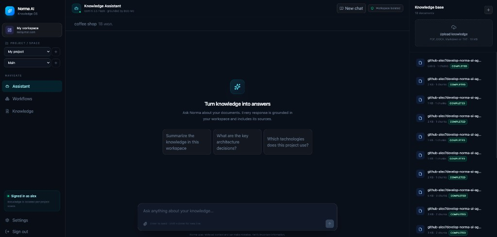
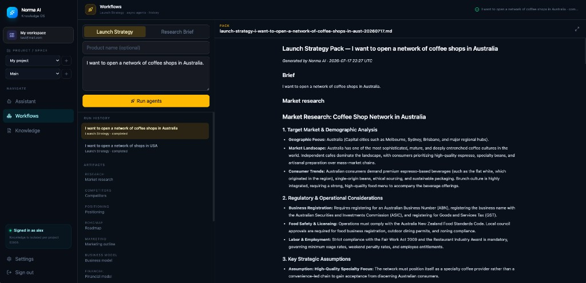
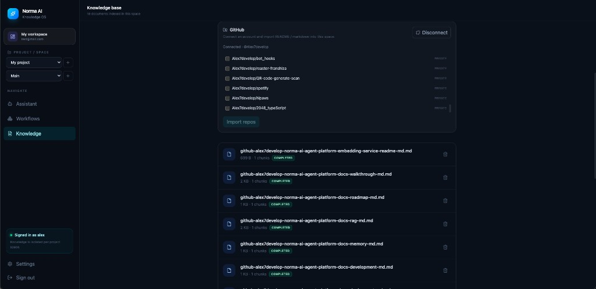

<div align="center">

# Norma AI

### The AI operating system for knowledge and execution

**An autonomous AI workspace that understands your information,  
remembers context, and helps you execute complex tasks.**

<br/>

[](https://www.python.org/)
[](https://fastapi.tiangolo.com/)
[](https://github.com/langchain-ai/langgraph)
[](https://qdrant.tech/)
[](https://www.docker.com/)
[](LICENSE)

<br/>

**Transform scattered information into structured knowledge and autonomous action.**

[Documentation](docs/README.md) · [Walkthrough](docs/walkthrough.md) · [Roadmap](docs/roadmap.md) · [Contributing](CONTRIBUTING.md) · [Changelog](CHANGELOG.md)

</div>

---

## The problem

Teams drown in scattered context: PDFs, Notion pages, GitHub READMEs, strategy
notes, and chat threads. Searching folders is slow. Pasting everything into a
generic chatbot is worse — answers are ungrounded, context leaks across projects,
and nothing turns research into a reusable pack you can ship from.

**Norma AI** is built for that gap: an **agentic Knowledge OS** where your
documents become a private, workspace-scoped brain — and agents help you **ask,
research, and execute**, not only chat.

---

## What Norma does (and why it exists)

Norma is not a single chatbot. It is a small operating layer around knowledge:

1. **Ingest** — upload files or import from Notion / GitHub into a knowledge space  
2. **Index** — chunk, embed (BGE-M3), store in Qdrant with workspace/space isolation  
3. **Ask** — RAG Assistant retrieves evidence and answers with source chips  
4. **Act** — multi-agent workflows (Launch Strategy, Research Brief) produce
   markdown artifacts and write them back into knowledge  
5. **Remember** — conversation threads + vectorized memory notes for later runs  

> Humans define goals. AI accelerates execution — grounded in *your* space.

```text
Register → upload / Notion / GitHub → ask Assistant → run a workflow
         → inspect artifacts → knowledge grows → ask again
```

---

## Who it is for

| Audience | How Norma helps |
|-|-|
| **Founders / PMs** | Turn a brief into a Launch Strategy pack (research → roadmap → PRD → content) |
| **Engineers** | Ground answers in repo docs and imported GitHub markdown — with citations |
| **Small teams** | Keep client or product knowledge isolated per workspace / project / space |

---

## What you get

| Surface | What it does |
|-|-|
| **Knowledge** | Upload PDF / DOCX / Markdown / TXT; async index into Qdrant; import from **Notion** and **GitHub** |
| **Assistant** | RAG Q&A with citations, conversation threads, New chat, workspace-isolated memory |
| **Workflows** | **Launch Strategy** (full pack) or **Research Brief** (short); async Redis worker + progress + artifacts |
| **Auth & tenancy** | Email/password, HttpOnly JWT cookies, workspace membership, projects & spaces |

Deep dives: [agents](docs/agents.md) · [RAG](docs/rag.md) · [memory](docs/memory.md) · [API](docs/api.md)

---

## Product screenshots

<p align="center">
  
  <br/>
  <em>Assistant — ask questions grounded in the active project space; documents index on the right.</em>
</p>

<p align="center">
  
  <br/>
  <em>Workflows — Launch Strategy / Research Brief run history, artifacts, and markdown pack reader.</em>
</p>

<p align="center">
  
  <br/>
  <em>Knowledge — upload files or connect GitHub / Notion and import into the space.</em>
</p>

---

## See it in action

### 1. Add knowledge

Open **Knowledge**, upload a document (or connect Notion / GitHub and import).
Wait until the status badge shows **completed**.

### 2. Ask the Assistant

Open **Assistant** → **New chat** → ask a question about your documents.
Answers include source chips grounded in the current knowledge space.

### 3. Run a workflow

Open **Workflows**, pick **Launch Strategy** or **Research Brief**, enter a brief,
run. Pipeline steps advance while the worker executes; artifacts open in the reader;
the persisted pack appears back in Knowledge.

Full product path: [docs/walkthrough.md](docs/walkthrough.md).

---

## What it does

| Capability | Details |
|-|-|
| **RAG knowledge base** | Chunk → embed (BGE-M3) → Qdrant; filtered by `workspace_id` + `space_id` |
| **Async ingest** | Upload returns **202**; Redis worker indexes; poll document status |
| **Notion connector** | OAuth → list shared pages → import as markdown into a space |
| **GitHub connector** | OAuth → list repos → import README + markdown files into a space |
| **RAG Assistant** | LangGraph retrieve → generate (or no-context); conversation memory |
| **Launch Strategy** | `retrieve → research → planning → spec → content → persist → memory` |
| **Research Brief** | `retrieve → research → persist` (shorter async pack) |
| **Web research** | DuckDuckGo snippets for the Research Agent (`WEB_SEARCH_ENABLED`) |
| **Vector memory** | Workflow summaries and notes as `source_type=memory` in Qdrant |
| **Worker readiness** | Redis heartbeat; `/api/v1/ready` fails if the worker is down |

---

## Architecture

```text
React (Vite)  →  FastAPI  →  services / LangGraph
                     │
        ┌────────────┼────────────┐
        ▼            ▼            ▼
   PostgreSQL      Redis       Qdrant
   (state)       (jobs)      (vectors)
                     │
                     ▼
              worker process
                     │
                     ▼
            embedding service (BGE-M3)
                     │
                     ▼
                 OpenRouter
```

Modular monolith with clear boundaries: API → application services → domain
contracts ← infrastructure adapters. Full write-up:
[docs/architecture.md](docs/architecture.md).

### Multi-agent workflows

**Launch Strategy** (worker):

```text
queued → retrieve → research → planning → spec → content → persist → done
```

**Research Brief** (worker):

```text
queued → retrieve → research → persist → done
```

**RAG Assistant** (request path): retrieve → generate (or no-context).

Details: [docs/agents.md](docs/agents.md).

---

## Prerequisites

| Requirement | Minimum | Notes |
|-|-|-|
| Docker + Compose | recent | Runs API, worker, Postgres, Redis, Qdrant, embeddings |
| Node.js | 20+ | Frontend Vite app |
| OpenRouter API key | — | LLM via `OPENROUTER_API_KEY` |
| Optional Notion OAuth | — | Knowledge import |
| Optional GitHub OAuth App | — | Repo README / markdown import |

---

## Quick start

```bash
git clone https://github.com/Alex7develop/norma-ai-agent-platform.git
cd norma-ai-agent-platform
cp .env.example .env
```

Edit `.env` and set at least:

```env
SECRET_KEY=<long-random-value>          # e.g. openssl rand -hex 32
OPENROUTER_API_KEY=sk-or-v1-...
```

Start the stack:

```bash
docker compose up --build
```

In another terminal, start the UI:

```bash
cd frontend
npm install
npm run dev
```

| URL | Purpose |
|-|-|
| http://localhost:5173 | React workspace |
| http://localhost:8000/docs | OpenAPI |
| http://localhost:8000/api/v1/health | Liveness |
| http://localhost:8000/api/v1/ready | Readiness (DB, Redis, Qdrant, embeddings, worker) |

> First embeddings boot may take several minutes while BGE-M3 downloads into the
> model volume.

Ops notes: [docs/deployment.md](docs/deployment.md) · local hacking:
[docs/development.md](docs/development.md)

---

## Usage

### Product surfaces

| View | Typical flow |
|-|-|
| **Assistant** | New chat → ask → sources; mobile menu opens the sidebar |
| **Workflows** | Pick Launch Strategy or Research Brief → run → poll → open artifacts |
| **Knowledge** | Upload file **or** Connect Notion / GitHub → select → Import |

### Integrations (optional)

**Notion** — create a Notion public integration / OAuth connection, then:

```env
NOTION_CLIENT_ID=...
NOTION_CLIENT_SECRET=...
NOTION_REDIRECT_URI=http://localhost:8000/api/v1/integrations/notion/callback
FRONTEND_ORIGIN=http://localhost:5173
```

Share pages with the integration in Notion, then Knowledge → Connect Notion → Import.

**GitHub** — create a [GitHub OAuth App](https://github.com/settings/developers)
with callback URL exactly:

`http://localhost:8000/api/v1/integrations/github/callback`

```env
GITHUB_CLIENT_ID=...
GITHUB_CLIENT_SECRET=...
GITHUB_REDIRECT_URI=http://localhost:8000/api/v1/integrations/github/callback
```

Scopes requested by Norma: `read:user` `repo`. Knowledge → Connect GitHub →
select repos → Import (README + up to 20 markdown files per repo).

After changing `.env`:

```bash
docker compose up -d --build backend worker
```

---

## Environment variables

| Variable | Required | Description |
|-|-|-|
| `SECRET_KEY` | yes | JWT + Fernet token encryption |
| `OPENROUTER_API_KEY` | yes (for LLM) | OpenRouter key |
| `OPENROUTER_MODEL` | no | Default `google/gemini-3.5-flash` |
| `DATABASE_URL` | compose | Async Postgres URL |
| `REDIS_URL` | compose | Job queue |
| `QDRANT_HOST` / `QDRANT_PORT` | compose | Vector store |
| `EMBEDDING_SERVICE_URL` | compose | BGE-M3 HTTP service |
| `WEB_SEARCH_ENABLED` | no | DuckDuckGo for Research Agent |
| `NOTION_*` | optional | Notion OAuth |
| `GITHUB_*` | optional | GitHub OAuth |
| `FRONTEND_ORIGIN` | OAuth | Post-callback redirect (default `http://localhost:5173`) |
| `CORS_ORIGINS` | no | JSON list of allowed origins |

Full template: [`.env.example`](.env.example).

---

## API surface (overview)

Base path: `/api/v1`

| Area | Highlights |
|-|-|
| Auth | register / login / logout / refresh (HttpOnly cookies) |
| Knowledge | upload **202**, list, get status, delete, search |
| Assistant | query, conversations, messages |
| Workflows | `POST /workflows/launch-strategy`, `POST /workflows/research-brief`, list/get runs |
| Integrations | Notion + GitHub authorize / callback / status / list / import |
| Health | `/health`, `/ready` |

See [docs/api.md](docs/api.md) and live OpenAPI at `/docs`.

---

## Tech stack

| Layer | Choice |
|-|-|
| API | FastAPI, Pydantic Settings, Alembic |
| Agents | LangGraph + OpenRouter |
| Vectors | Qdrant + BGE-M3 embedding service |
| Jobs | Redis list queue + unified worker |
| Auth | JWT access + hashed refresh cookies |
| UI | React + Vite + Tailwind |
| Deploy | Docker Compose |

---

## Documentation

| Path | Description |
|-|-|
| [docs/README.md](docs/README.md) | Docs index |
| [docs/architecture.md](docs/architecture.md) | System design |
| [docs/agents.md](docs/agents.md) | Agents & LangGraph |
| [docs/rag.md](docs/rag.md) | Knowledge engine |
| [docs/memory.md](docs/memory.md) | Conversations & notes |
| [docs/api.md](docs/api.md) | HTTP overview |
| [docs/deployment.md](docs/deployment.md) | Docker / ops |
| [docs/development.md](docs/development.md) | Contributor setup |
| [docs/walkthrough.md](docs/walkthrough.md) | End-to-end product path |
| [docs/roadmap.md](docs/roadmap.md) | Phased roadmap |

Community: [CONTRIBUTING.md](CONTRIBUTING.md) · [SECURITY.md](SECURITY.md) ·
[CODE_OF_CONDUCT.md](CODE_OF_CONDUCT.md) · [CHANGELOG.md](CHANGELOG.md)

---

## Roadmap

Phases 1–4 are complete for the MVP product surface. **Phase 5** has started
with **Notion** and **GitHub** (OAuth + knowledge import). Remaining: Slack,
Google Drive, CRM.

Full checklist: [docs/roadmap.md](docs/roadmap.md).

---

## Security & privacy

- Workspace membership isolation on knowledge, assistant, workflow, and project APIs
- HttpOnly cookies; refresh tokens stored as SHA-256 hashes and revocable on logout
- Integration tokens encrypted at rest (Fernet derived from `SECRET_KEY`)
- Retrieved / web / connector content is treated as **untrusted** prompt context

Report vulnerabilities per [SECURITY.md](SECURITY.md).

---

## Troubleshooting

| Symptom | What to check |
|-|-|
| `/ready` fails | `docker compose ps`; worker healthy? embeddings healthy? |
| Upload stuck on `pending` | Worker logs: `docker compose logs -f worker` |
| Assistant “no context” | Document status **completed**? Correct project/space selected? |
| Notion empty page list | Share pages with the integration in Notion UI |
| GitHub OAuth error | Callback URL exact match; `GITHUB_*` in `.env`; rebuild backend |
| LLM errors | `OPENROUTER_API_KEY` set and valid; model name in `OPENROUTER_MODEL` |
| Slow first boot | BGE-M3 model download into Docker volume (one-time) |

---

## Development

```bash
# Backend tests (host venv)
python -m venv .venv
source .venv/bin/activate   # Windows: .venv\Scripts\activate
pip install -e ".[dev]"
pytest

# Frontend
cd frontend && npm install && npm run build
```

See [docs/development.md](docs/development.md) and [CONTRIBUTING.md](CONTRIBUTING.md).

---

## Philosophy

AI should amplify creativity, decisions, and execution — not replace judgment.

---

## Support

- Star the repository
- Open issues with repro steps and logs
- Share product feedback

<div align="center">

### The intelligent operating system for the next generation of work.

</div>
